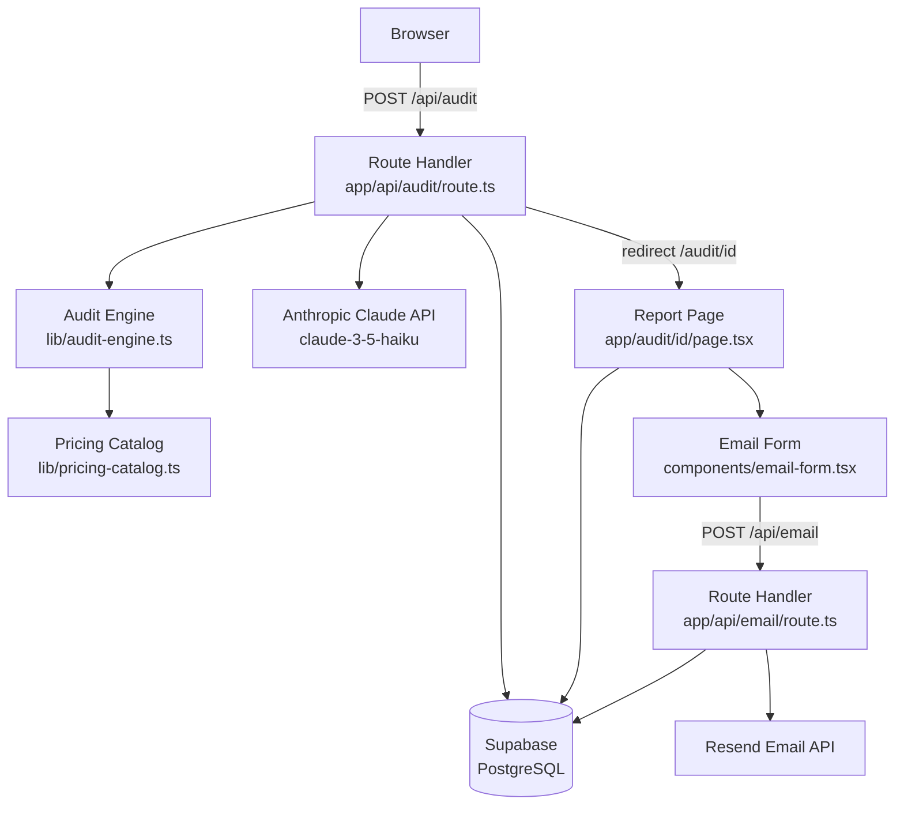

# System Architecture: AI Spend Auditor

## System Diagram



## Request Flow

1. User fills the audit form on `/` and submits
2. Browser POSTs JSON to `/api/audit`
3. Route Handler validates input (Zod), runs Audit Engine, generates UUID, writes to Supabase
4. Claude API called with 30s timeout — generates 100-word summary
5. Summary written to Supabase (non-blocking — audit succeeds even if Claude fails)
6. Handler redirects to `/audit/[id]`
7. Next.js renders Server Component — fetches audit from Supabase, renders full report
8. User optionally submits email → `POST /api/email` → Resend sends report → email persisted

## Technology Choices

### Why Next.js 16
- Full-stack in one repo — API routes and UI in the same codebase
- App Router with Server Components — report page fetches data server-side, no client-side loading states
- Zero-config Vercel deployment — push to GitHub, it's live
- `redirect()` and `notFound()` built-in — clean error handling without custom middleware

### Why Supabase
- Free tier covers 500MB storage and 50,000 monthly active users — more than enough for MVP
- PostgreSQL with JSONB — `tool_results` stored as structured JSON, queryable if needed
- Built-in UUID generation and timestamps
- Service role key allows server-side writes without exposing credentials to the browser

### Why Vercel
- Zero-config deployment — connects to GitHub, auto-deploys on push
- Edge network — fast globally without configuration
- Free tier covers the expected traffic volume
- Environment variables managed in dashboard

### Why Anthropic Claude (Haiku)
- Fastest and cheapest Claude model — ideal for short text generation
- `claude-3-5-haiku-20241022` generates 100-word summaries in ~2 seconds
- Cost: ~$0.008 per audit — negligible at MVP scale
- Graceful degradation: if Claude fails, audit still completes with empty summary

### Why Resend
- Simple API — one function call to send HTML email
- Free tier: 3,000 emails/month — sufficient for early growth
- Reliable delivery with good developer experience

## Trade-offs Considered

| Decision | Alternative | Why We Chose This |
|----------|-------------|-------------------|
| Supabase | Firebase | Supabase has better free tier SQL, easier to query structured data |
| Hardcoded pricing catalog | Database table | Versioned in source control, no runtime fetch, trivially testable |
| Server Components for report | Client-side fetch | No loading states, better SEO, simpler code |
| Vitest + fast-check | Jest | Vitest is faster, fast-check enables property-based testing |
| proxy.ts | middleware.ts | middleware.ts deprecated in Next.js 16 |

## File Structure

```
app/
  page.tsx                    # Home — renders AuditForm
  layout.tsx                  # Root layout with metadata
  audit/[id]/
    page.tsx                  # Report page (Server Component)
    not-found.tsx             # 404 for invalid audit IDs
    error.tsx                 # Error boundary for Supabase failures
  api/
    audit/route.ts            # POST — run audit, persist, redirect
    email/route.ts            # POST — send report via Resend

components/
  audit-form.tsx              # Multi-row form with validation
  tool-entry-row.tsx          # Single tool entry row
  report-metrics.tsx          # Summary metrics display
  report-breakdown-table.tsx  # Per-tool breakdown table
  report-suggestions.tsx      # Savings suggestions list
  copy-link-button.tsx        # Clipboard copy with confirmation
  email-form.tsx              # Email capture with useActionState

lib/
  pricing-catalog.ts          # Static 15-tool pricing data
  audit-engine.ts             # Pure savings calculation functions
  supabase.ts                 # Server-side Supabase client
  claude.ts                   # Anthropic API wrapper
  resend.ts                   # Resend email wrapper
  validations.ts              # Zod schemas
  types.ts                    # Shared TypeScript interfaces
  uuid.ts                     # crypto.randomUUID wrapper

proxy.ts                      # Next.js 16 proxy (replaces middleware.ts)
```
