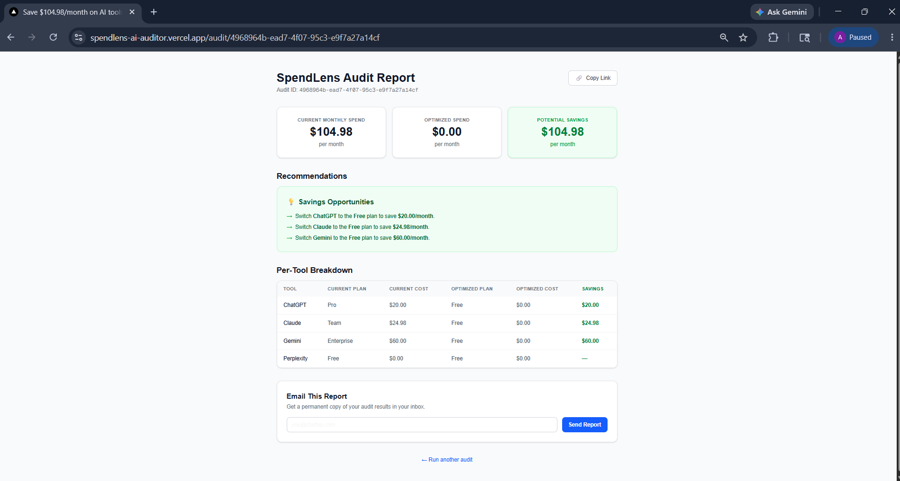

# SpendLens — AI Spend Auditor

> Find out how much your startup wastes on AI tools. Free audit in 60 seconds.

SpendLens is a free web tool for startup founders and engineering managers to audit their AI tool subscriptions. Enter your current tools, plans, seat counts, and monthly costs — SpendLens compares what you pay against the cheapest viable plan and shows you exactly where you're overspending. Results are saved to a shareable URL with a Claude-generated personalized summary.

**Live URL:** https://spendlens-ai-auditor.vercel.app

---

## Screenshots

**Home page - audit input form**


**Report page - savings breakdown with AI summary**



---

## Quick Start

### Prerequisites
- Node.js 20+
- A Supabase project with the tables below
- Anthropic API key
- Resend API key

### Install and run locally

```bash
git clone https://github.com/ankitnegi-dev/credex-ai-auditor
cd credex-ai-auditor
npm install
```

Create `.env.local`:

```env
SUPABASE_URL=your_supabase_url
SUPABASE_SERVICE_ROLE_KEY=your_service_role_key
ANTHROPIC_API_KEY=your_anthropic_key
RESEND_API_KEY=your_resend_key
NEXT_PUBLIC_BASE_URL=http://localhost:3000
```

### Supabase setup

Run this SQL in your Supabase SQL editor:

```sql
CREATE TABLE audits (
  id                    UUID PRIMARY KEY,
  tool_results          JSONB NOT NULL,
  total_spend           NUMERIC(10, 2) NOT NULL,
  total_optimized_spend NUMERIC(10, 2) NOT NULL,
  total_savings         NUMERIC(10, 2) NOT NULL,
  summary               TEXT NOT NULL DEFAULT '',
  created_at            TIMESTAMPTZ NOT NULL DEFAULT now()
);

CREATE TABLE audit_emails (
  id        UUID PRIMARY KEY,
  audit_id  UUID NOT NULL REFERENCES audits(id),
  email     TEXT NOT NULL,
  sent_at   TIMESTAMPTZ NOT NULL DEFAULT now(),
  UNIQUE (audit_id, email)
);

ALTER TABLE audits DISABLE ROW LEVEL SECURITY;
ALTER TABLE audit_emails DISABLE ROW LEVEL SECURITY;
```

### Run

```bash
npm run dev
```

Open [http://localhost:3000](http://localhost:3000).

### Run tests

```bash
npx vitest run
```

### Deploy

```bash
npx vercel --prod
```

Add all environment variables in the Vercel dashboard under Settings → Environment Variables.

---

## Decisions

Five key trade-offs made during the build:

**1. Hardcoded pricing catalog over a database table**
The pricing catalog is a TypeScript constant in `lib/pricing-catalog.ts`, not a database table. This makes it version-controlled, trivially testable with property-based tests, and eliminates a runtime fetch. The trade-off is that updating prices requires a code change and deployment — acceptable for an MVP where pricing data changes infrequently.

**2. Server Components for the report page over client-side fetching**
`app/audit/[id]/page.tsx` is an async Server Component that fetches directly from Supabase. No loading states, no client-side data fetching, better SEO, and the Supabase service role key never reaches the browser. The trade-off is that the page requires a server round-trip on every load — acceptable given the data is not real-time.

**3. UUID URLs over user authentication**
Each audit gets a unique UUID URL with no login required. This eliminates auth friction entirely — a user can share their audit URL with a co-founder or CFO without them needing an account. The trade-off is that users cannot see a list of their past audits. For an MVP focused on viral sharing, this is the right call.

**4. Property-based testing over example-based tests**
Used fast-check for all audit engine tests, running 100 random inputs per property. This caught an edge case (seats exactly equal to minSeats threshold should be eligible) that example-based tests would have missed. The trade-off is slightly longer test setup time and less readable test cases for non-PBT-familiar developers.

**5. Claude Haiku over GPT-4 for the AI summary**
`claude-haiku-4-5` generates the 100-word audit summary at ~$0.008 per audit. GPT-4 would produce marginally better prose but at 10x the cost. For a free tool where the summary is a nice-to-have (the audit math is the core value), Haiku is the right economic choice. The summary degrades gracefully to empty string on API failure.

---

## Tech Stack

| Layer | Choice | Reason |
|-------|--------|--------|
| Framework | Next.js 16 (App Router) | Full-stack, Server Components, built-in API routes, Vercel deploy |
| Language | TypeScript | Type safety across the full stack |
| Styling | Tailwind CSS | Rapid UI development, no custom CSS needed |
| Database | Supabase (PostgreSQL) | Free tier, JSONB for tool results, easy UUID generation |
| AI Summary | Anthropic Claude Haiku | Fastest/cheapest Claude model, sufficient for 100-word summaries |
| Email | Resend | Simple API, free tier covers early growth |
| Testing | Vitest + fast-check | Fast test runner + property-based testing for audit engine |
| CI | GitHub Actions | Lint + test on every push to main |
| Deployment | Vercel | Zero-config, auto-deploys on push |

---

## Project Structure

```
app/
  page.tsx                    # Home — SpendLens audit form
  audit/[id]/page.tsx         # Report page (Server Component)
  api/audit/route.ts          # POST — run audit, save to Supabase, redirect
  api/email/route.ts          # POST — send report via Resend

components/
  audit-form.tsx              # Multi-tool input form
  report-metrics.tsx          # Total spend / savings display
  report-breakdown-table.tsx  # Per-tool breakdown
  report-suggestions.tsx      # Savings recommendations
  email-form.tsx              # Email capture

lib/
  pricing-catalog.ts          # Static pricing data for 15 AI tools
  audit-engine.ts             # Pure savings calculation functions
  supabase.ts                 # Server-side Supabase client
  claude.ts                   # Anthropic API wrapper
  resend.ts                   # Resend email wrapper
  validations.ts              # Zod schemas
  types.ts                    # Shared TypeScript interfaces
```
